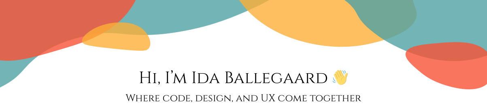

 
 

🎨💻 Web developer with a strong focus on the intersection of **programming, design, and UX**.

I’m driven by creating **well-rounded digital solutions** where code doesn’t just work — it supports a meaningful and intuitive user experience.

I believe the best products are built where **logic meets aesthetics** and where technology serves both the user and the business.

---

## 🧠 About Me
I’m currently studying **Web Development** at [Syddansk Erhvervsakademi](chatgpt://generic-entity?number=0).  
My specialization lies in frontend development, combined with hands-on experience in backend development.

I enjoy translating ideas, wireframes, and user insights into **functional, accessible, and visually cohesive solutions**.  
My work is driven by clarity, attention to detail, and a strong understanding of how users interact with digital products — from interface to logic.

I value thoughtful problem-solving and see code as a tool to support both usability and long-term maintainability.

---

## 🛠️ Tech Stack

### 🎨 Frontend

  
  
  
  
  

### ⚙️ Backend

  
  
  

### 🧩 CMS / Platforms

  

---

## 🌱 I’m Currently Learning
- Improving component architecture and state management in Vue.js
- Writing more maintainable and scalable frontend code
- Strengthening backend logic and data handling
- Applying UX principles more systematically in development

---

## 🔍 What I Focus On
- Building clear and intuitive interfaces
- Writing structured, maintainable, and readable code
- Bridging design and development
- Creating solutions that balance user needs with technical requirements

---

## 🚀 Goals & Ambitions
I aspire to work on **meaningful digital products**, where I can combine my technical skills with my passion for **design and user experience**.  
I thrive in collaborative environments that value quality, curiosity, and continuous learning.

---

## 🤝 Let’s Connect
- 💼 LinkedIn: https://www.linkedin.com/in/ida-ballegaard

---

✨ Thanks for visiting my profile!

---
